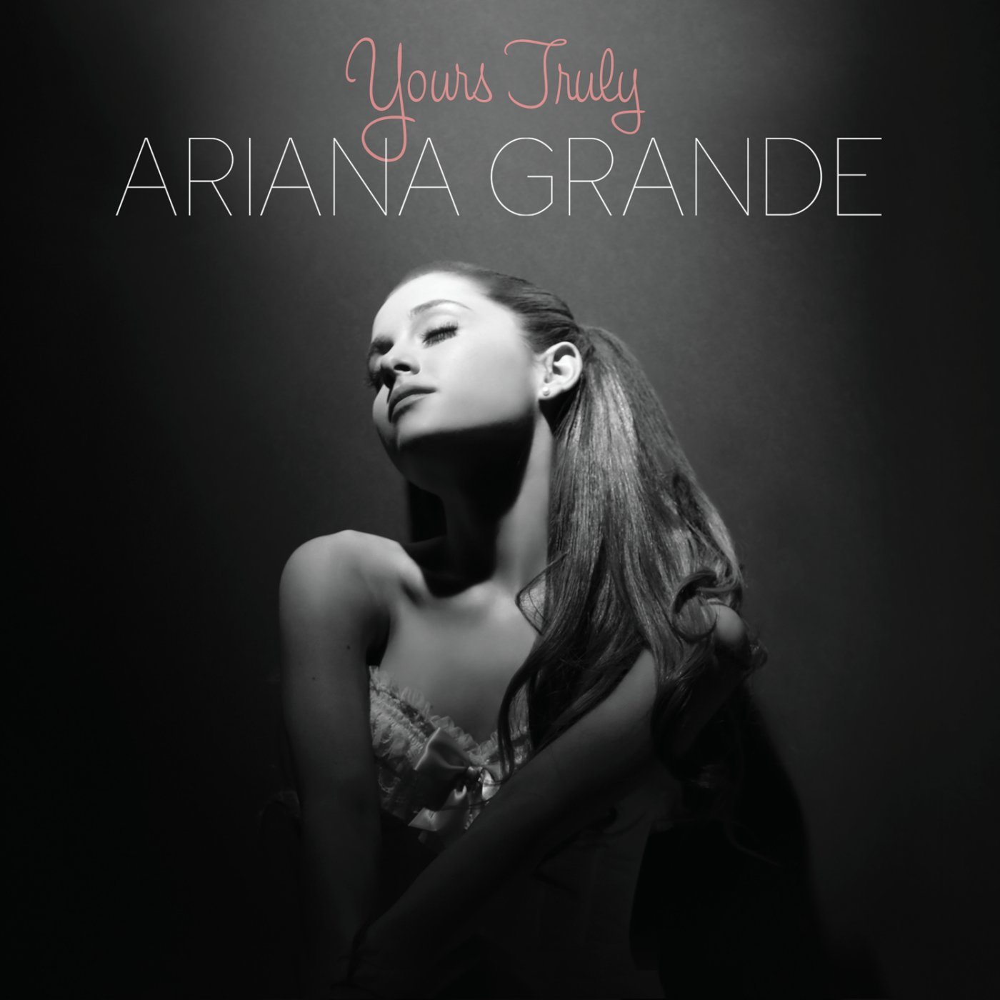

# Yours Truly (2013): Finding Her Sound

## Background

### Leaving Nickelodeon Behind

After her time on *Victorious* and *Sam & Cat*, Ariana Grande began shifting her focus away from acting and toward a full-time music career. The end of *Sam & Cat* in 2014 marked a clear turning point, but even before that she was already working on developing her debut album. She collaborated closely with producer Babyface, along with other R&B-influenced writers and producers, to shape a sound that reflected her vocal strengths. This period was important because it introduced her as a serious recording artist rather than just a television star.

### Musical Style

- R&B
- Pop
- Soul
- Mariah Carey influences

The album blends modern pop production with classic R&B and soul elements. Ariana’s vocal delivery is heavily inspired by Mariah Carey, especially in her use of whistle tones, layered harmonies, and vocal runs. The overall sound feels nostalgic while still being fresh for early 2010s pop.

## Popular Songs

- The Way
- Baby I
- Right There

These tracks helped establish Ariana’s identity as a vocalist. *The Way* in particular became her breakout hit and introduced her to a mainstream pop audience.

## Legacy

*Yours Truly* is widely seen as the project that introduced Ariana Grande’s signature voice to the world. While she was still early in her career, the album showed her potential to blend R&B and pop in a way that stood out from other emerging artists at the time. It set the foundation for her future evolution into a global pop star.

### Related Eras

- [[3my-everything|My Everything]] 
- [[4dangerous-woman|Dangerous Woman]] 

> "Every artist starts somewhere, and Yours Truly introduced Ariana's unmistakable voice to the world."