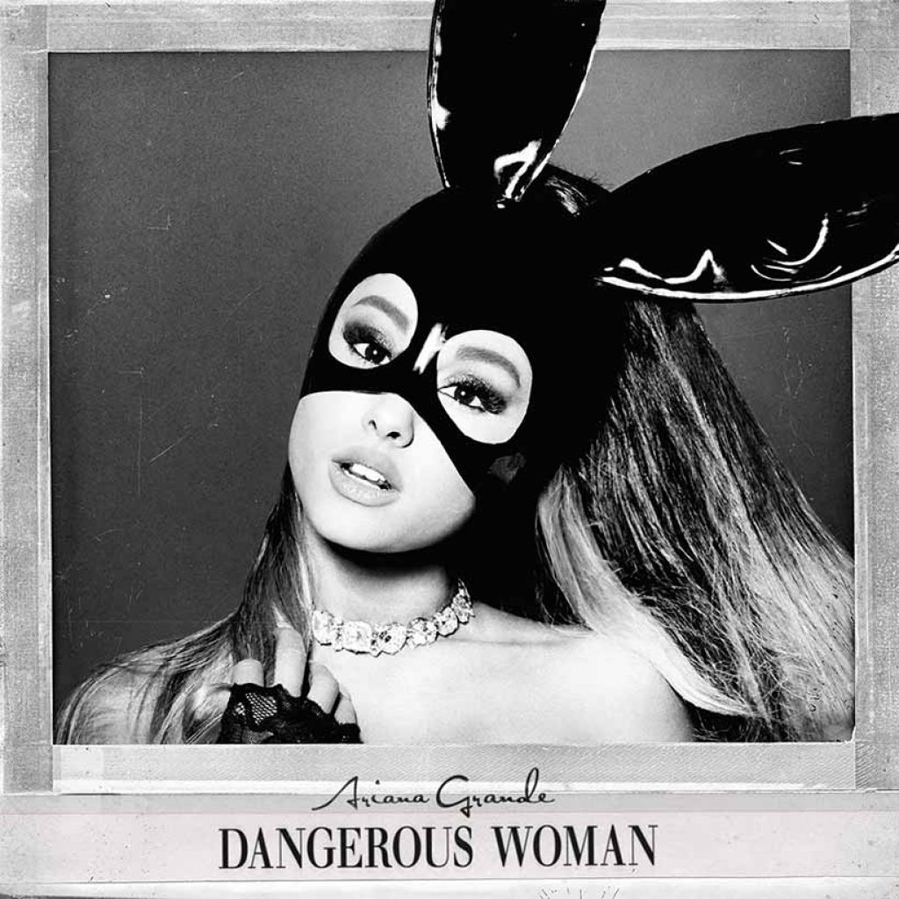

# Dangerous Woman (2016): A More Mature Image

## Background

### A New Direction

After the success of *My Everything*, Ariana Grande originally planned to title this album *Moonlight*. However, during the creative process, she chose to shift the concept and rename it *Dangerous Woman*, reflecting a stronger and more confident artistic identity. This change marked a turning point in her career, as she moved away from her earlier “girl-next-door” image and began embracing a more mature and self-assured persona.

### Themes

- Confidence
- Independence
- Relationships

The album focuses on self-expression and emotional growth, highlighting Ariana’s increasing control over her artistic direction.

## Standout Songs

- Dangerous Woman
- Into You
- Side to Side

These tracks showcase different sides of the album’s identity. *Dangerous Woman* emphasizes vocal power and maturity, *Into You* became one of her most critically praised pop songs, and *Side to Side* introduced a more playful, genre-blending sound.

## Dangerous Woman Tour

The *Dangerous Woman Tour* marked a major milestone in Ariana’s career as her first large-scale global tour. It demonstrated her ability to command major stages and solidified her status as a top-tier pop performer. The era overall represented a clear transition from rising pop star to established global artist.

### Related Eras

- [[my-everything|My Everything]] 
- [[sweetener-thank-u-next|Sweetener & Thank U, Next]] 

> "Dangerous Woman marked Ariana's transformation from rising pop star into an established artist."