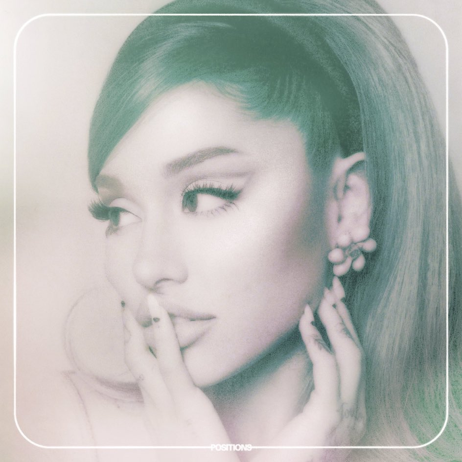
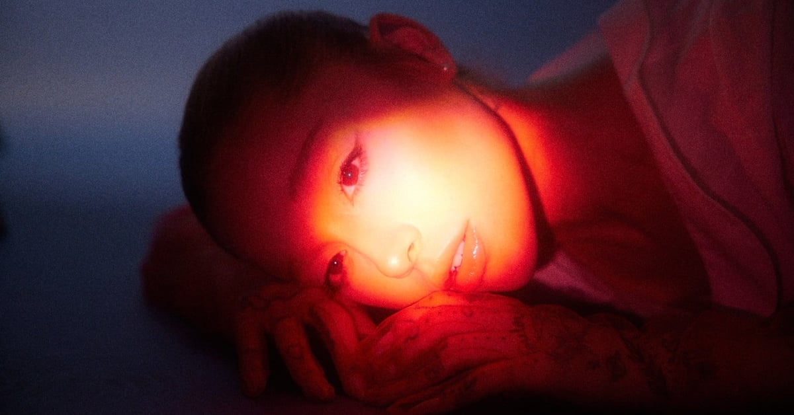

# Positions & Eternal Sunshine (2020–2024): Growth, Reflection, and the Future

## Positions

### A Softer Sound

*Positions* marked a shift toward a softer, more R&B-influenced sound in Ariana Grande’s discography. Released during the COVID-19 pandemic, the album reflects a more intimate and restrained creative approach compared to her earlier, more high-energy pop projects. The songwriting focuses on mature relationships, emotional stability, and personal vulnerability, showing Ariana in a more settled and reflective stage of her life.

### Popular Songs

- Positions
- POV
- 34+35

These songs highlight the balance between sensuality and emotional depth, with *Positions* in particular showcasing her vocal control in a more relaxed, mid-tempo style.

---

## Eternal Sunshine

### Returning After Wicked

After spending time filming *Wicked* and stepping back from music, Ariana returned with *Eternal Sunshine*, an album shaped by personal reflection and major life changes, including her divorce and ongoing public scrutiny. The project is structured as a concept album, blending storytelling with emotional honesty. It reflects both closure and rediscovery, marking another turning point in her artistic journey.

### Songs

- We Can't Be Friends
- Yes, And?
- The Boy Is Mine

These tracks emphasize self-awareness, independence, and emotional processing, showing a more introspective version of Ariana’s artistry.

---

## Looking Forward

Across her career, Ariana Grande has continuously evolved in sound, image, and emotional depth. *Positions* and *Eternal Sunshine* demonstrate her ability to adapt while maintaining a consistent vocal identity. Looking forward, fans expect her to continue blending personal storytelling with innovative pop production as she enters a more mature phase of her career.

### Related Eras

- [[sweetener-thank-u-next|Sweetener & Thank U, Next]] 
- [[yours-truly|Yours Truly]] 

> "Even after more than a decade in music, Ariana continues to reinvent herself while staying true to her voice."